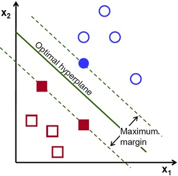

# 支持向量机 Support Vector Machine

## 概述
支持向量机(SVM)是Corinna Cortes和Vapnik等人提出的，它在解决小样本、非线性及高维模式识别中表现出许多特有的优势，并能够推广应用到函数拟合等其他机器学习问题中。在机器学习中，支持向量机是与相关的学习算法有关的监督学习模型，常用作分类器。

## 最大间隔分类器 Maximal Margin Classifier
p维欧氏空间 $\mathbb{R}^p$ 上的超平面可以表示为
$$
\beta_0 + \beta_1 x_1 + \beta_2 x_2 + ... + \beta_p x_p = 0
$$

超平面可以简记为$ X^T \beta + \beta_0 = 0 $，其中$\beta = (\beta_1,...,\beta_p)$，对 $\mathbb{R}^p$上的一个点 $x = (x_1,...,x_p)^T$
$$
\left \lbrace
\begin{array}{lll}
x^T \beta + \beta_0 < 0\ ,\ if\ x\ is\ under\ the\ hyperplane\\ \\
x^T \beta + \beta_0 = 0\ ,\ if\ x\ is\ on\ the\ hyperplane \\ \\
x^T \beta + \beta_0 > 0\ ,\ if\ x\ is\ above\ the\ hyperplane
\end{array} \right .
$$ 由此得到了$\mathbb{R}^p$的一个划分。

假设有n个p维的训练样本观测
$$ x_1=(x_{1,1},...,x_{1,p})^T , ...... , x_n=(x_{n,1},...x_{n,p})^T $$
这些观测可以分为两类，类标签记作 $y_1,...,y_n \in \{-1,1\}$，将训练样本观测表示为$n*p$的矩阵则有
$$
X = \begin{bmatrix}
x_{1}^T \\ \\
\vdots \\ \\
x_{n}^T
\end{bmatrix} = 
\begin{bmatrix}
x_{1,1} & \cdots & x_{1,p} \\ \\
\vdots & \ddots & \vdots \\ \\
x_{n,p} & \cdots & x_{n,p}
\end{bmatrix} \ \ \ \ 
Y = \begin{bmatrix}
y_{1} \\ \\
\vdots \\ \\
y_{n}
\end{bmatrix} 
$$

分类的目标是将测试样本观测$x^*=(X_1^*,...,X_p^*)$正确的分类，为了实现这个分类，引入基于分离平面的方法：
假设可以找到一个超平面 $H=\{X|\beta_0+\beta X=0\}$ ，使得训练样本可以准确无误地分成符合标签两类
$$
\left \lbrace
\begin{array}{lll}
x_i^T \beta + \beta_0 < 0 \ \ , if\ \ y_i=-1 \\ \\
x_i^T \beta + \beta_0 > 0 \ \ , if\ \ y_i=1
\end{array} \right.
\ \ \forall i \in \{1,...,n\}
$$ 等价地，可以把这两个式子综合为：

$$
y_i(x_i^T \beta + \beta_0) > 0\ \ \ \forall i = 1,...,n
$$

这就是分离平面 $x_i^T \beta + \beta_0 = 0$ 将所有训练样本正确地划分到两侧的充要条件。


如果这样的分离平面存在，就可以很自然地用它建立一个二分类器，分类的结果取决于测试样本点落在超平面的哪一测，即根据 $f(x) = x_i^T \beta + \beta_0$的符号分类，如果$f(x^*)$为负，则将$x$分类到 -1 类，如果$f(x)$为正，则将$x$分类到 1 类。另外，$|f(x^*)|$ 的大小也有一定的意义，如果$|f(x^*)| \gg 0$，说明这个点远离分离平面，意味着这个分类结果置信度更高。反过来说，如果 $|f(x^*)|$ 比较小，那么这个分类结果的置信度就比较低。

一般来说，如果样本是线性可分的，那么分离超平面很可能不止一个，即对于某一个分离超平面$H$，稍微调整之后得到的超平面 $H' = H + \epsilon$ 依然可以将样本准确划分。为了构建一个基于分离超平面的分类器，我们需要一个合适的标准。

我们可以计算所有观测样本到超平面的距离 $d_i$ ，找出其中距离最小的一个样本，将它到超平面的距离称为边距（margin） $M$。一个很自然的分离超平面的选择就是使得边距最大的超平面，称为最大边距超平面（maximal margin hyperplane），也称为最佳分离超平面（optimal separating hyperplane）。如果将这个的最大边距超平面用于分类得到的分类器，称为最大边距分类器（maximal margin classifier），又称硬边界的支持向量机（hard margin support vector machine）。需注意的是在特征维数 $p$ 足够大的时候，比如 $p = n$ 时，这个分类器很有可能会过拟合，因此要获得合适的分离平面，要考虑添加适当的正则化项以调整训练目标。

给定训练样本 $ x_1,...,x_n \in \mathbb{R}^p$ ，和分类标签 $y_1,...,y_n \in \{-1,1\}$，那么最大边距分类器就是如下问题的解：
$$
\underset{\beta_0,...,\beta_p}{\mathrm{maximize}} M
$$

$$
\mathrm{subject\ to}\ \ \frac{y_i(x_i^T \beta + \beta_0)}{\|\beta\|^2} \geq M > 0 \ \ \ \ \forall i=1,...,n
$$

由于$(\beta_1,...,\beta_p)^T$ 为超平面的法向量，则样本 $x_i$ 到超平面的距离为
$$
m_i = \frac{|x_i^T \beta + \beta_0|}{\|\beta\|_2} = \frac{y_i(x_i^T \beta + \beta_0)}{\|\beta\|_2}
$$

限制 $m_i > M$ 就是要求所有的样本都被正确地分到分离超平面的两侧，结合前面即有
$$ M = \mathrm{min}\ m_i\ ,\ i = 1,...,n$$

最大化边距的问题也就变成了最小化 $\|\beta\|_2$，等价于最小化$\|\beta\|_2^2$，优化问题可以改写为：
$$
\begin{array}{ccc}
\underset{\beta,\beta_0}{min}\ \|\beta\|_2^2\\ \\
\mathrm{subject\ to}\ y_i(x_i^T \beta + \beta_0) > 0 ,\ \forall i=1,...,n
\end{array}
$$

从优化问题的角度看，优化的目标函数是二次项，那么可以添加一个常数系数方便求导时约去，开区间限制没那么好处理，也可以稍微改一下，最终可以将问题修正为
$$
\begin{array}{ccc}
\underset{\beta,\beta_0}{min}\ \dfrac{1}{2}\|\beta\|_2^2\\ \\
\mathrm{subject\ to}\ y_i(x_i^T \beta + \beta_0) \geq 1 ,\ \forall i=1,...,n
\end{array}
$$

第一项乘一个常数系数不影响解，而第二项相当于改变了求解的空间，要求分离平面距离两个分类的点都必须有一段距离，即样本点不能落在分离平面上，而这其实对求解空间的影响也非常小，因为前面就假设了样本必须是线性可分的，那就意味着任意样本不会落在分离平面上，因此做这个修改也不影响求解。

如下图，实线为分离平面$x_i^T \beta + \beta_0 = 0$ ，两条虚线则为 $x_i^T \beta + \beta_0 = \pm 1$ ，虚线到实线的距离即为边距 $1/\|\beta\|_2$。


这个问题可以很容易地用拉格朗日乘子法求解，与下面求解的过程类似但简单很多，再此就不多做求解，直接进一步改进模型之后再求解添加了正则化项的模型。

## 支持向量分类器 Support Vector Classifier
如果样本观测不是严格的线性可分，那么前面基于分离平面的最大边距分类器将训练样本完全准确划分成两类是不妥当的，分离平面对接近分离平面的样本点过于敏感，可能导致过拟合。而且，基于硬边界原则得到的分类器可能只有一个很小的边距，而我们对分类的置信度与样本点距离分离平面的距离有关。由此，我们考虑允许对训练样本的不完全准确的分类，以求获得更大的边距（Margin），那么可以将问题的写为
$$
\begin{array}{ccc}
\underset{\beta,\beta_0}{min}\ \dfrac{1}{2}\|\beta\|_2^2 + C \sum\limits_{i=1}^{p} Loss( y_i(x_i^T \beta + \beta_0)) \\ \\
\end{array}
$$ 其中Loss为某一损失函数，一个直接的想法是用0/1损失，但是0/1损失的性质不方便求解，通常用hinge loss,指数损失，对率损失等代替，此处使用hinge loss，则模型写为：
$$
\begin{array}{ccc}
\underset{\beta,\beta_0}{min}\ \dfrac{1}{2}\|\beta\|_2^2 + C \sum\limits_{i=1}^{p} \max(0,1-y_i(x_i^T \beta + \beta_0)) \\ \\
\end{array}
$$ 引入松弛变量，将其改写为：
$$
\begin{array}{ccc}
\underset{\beta,\beta_0}{min}\ \dfrac{1}{2}\|\beta\|_2^2 + C\sum\limits_{i=1}^{p} \xi_i \\ \\
\mathrm{subject\ to}\ y_i(x_i^T \beta + \beta_0) \geq 1-\xi_i\ ,\ \xi_i\geq0 \ \ \forall i=1,...,n
\end{array}
$$

其中，$C \geq 0$，$\xi_1,...,\xi_n$为松弛变量，以允许单个的观测落到错误地分类，$\sum\limits_{i=1}^{p} \xi_i$可以看作错分的总量。
一旦我们解得 $\beta$ ，得到超平面 $x^T \beta + \beta_0=0$ ，就可以对测试样本观测 $x^*$ 分类。与最大间隔分类器一样，也是利用 $f(x^*) = x^{*T} \beta + \beta_0$ 的符号分类。

最终得到的$\xi_i$的含义是，若$\xi_i>0$，那么意味着第 $i$ 个训练样本的位置在边距以内（violated the margin）；若$\xi_i>1$，那么意味着第i个样本在分离平面错误的一侧。加入这一项的目的是，如果错分少数几个样本，可以大幅增大边距 $M$ ，那么就容忍这些错分的样本，$C$ 越大，错分的代价就约高，倾向于尽可能正确地分离训练集。参数 $C$ 是可调节的参数，一般可以通过交叉验证（cross validation）确定。

问题求解得到的分类器称为支持向量分类器（support vector classifier），也称为软边界的支持向量机（soft margin support vector machine），而哪些落在边界(Margin)上或者边界内的样本则称为支持向量（support vector），支持向量机的训练结果只取决于所有的支持向量，其他的向量称为非支持向量（non-support vector），对训练结果没有影响。

考虑问题的拉格朗日函数
$$
L(\beta_0,\beta,\varepsilon,a,b) =
\dfrac{1}{2}\|\beta\|_2^2 + C \sum_{i=1}^p  \xi_i^2 - \sum_{i=1}^n  a_i\left[1-\xi_i - y_i(\beta_0+\beta^T x_i) \right] - \sum_{i=1}^n b_i \xi_i
$$

其中，$a_i,b_i$ 是拉格朗日乘子，将问题转化为拉格朗日对偶问题
$$
\underset{a,b}{max} \underset{\beta_0,\beta,\xi}{inf}\ L(\beta_0,\beta,\xi,a,b)\ \ \mathrm{subject\ to}\ a,b \geq 0
$$

$L$分别对$\beta_0,\beta,\xi$求导
$$
\begin{array}{ccc}
\dfrac{\partial L}{\partial \beta_0} = 0 &\Rightarrow& \sum_{i=1}^n a_i y_i = 0 \\ \\
\dfrac{\partial L}{\partial \beta} = 0 &\Rightarrow& \beta = \sum_{i=1}^n a_i y_i x_i \\ \\
\dfrac{\partial L}{\partial \xi_i} = 0 &\Rightarrow& a_i + b_i = C
\end{array}
$$

可以看到 $\beta,b$ 都可以由 $a,x,y$ 来表示，而$a_i + b_i = 0$则允许我们消去$L(\beta_0,\beta,\xi,a,b)$ 中的$\xi$，拉格朗日对偶问题化为
$$
\begin{array}{lll}
\hat{a} = \underset{a}{\mathrm{argmax}} \left[ \sum_{i=1}^n  a_i - \sum_{i,j=1}^n  a_i a_j y_i y_j x_i^T x_j \right] \\ \\
\mathrm{subject\ to\ } \sum_{i=1}^n a_i y_i = 0 ,\ 0\leq a_i \leq C \ \ \forall i=1,...,n
\end{array} \ \ \ \ \ \ (1)
$$

又由解$\hat{a}_i$可以得到
$$ \hat{\beta} = \sum_{i=1}^n \hat{a}_i y_i x_i \ \ \ \ (2)$$ 

以及
$$ \hat{\beta_0} = y_i - \sum_{j:\hat{a_i}>0} \hat{a}_i y_j x_i^T x_j \ \ \ \ (3)$$

如果再考虑KKT条件的要求
$$
\left \lbrace
\begin{array}{lll}
a_i \geq 0 , b_i \geq 0 \\ \\
m_i-1+\xi_i \geq 0 \\ \\
a_i (m_i-1+\xi_i)=0\\ \\
\xi_i \geq 0\ ,\ \beta_i \xi_i=0 \ \ \ \forall i=1,...,n 
\end{array} \right .
$$
其中 $m_i=y_i(\beta x_i + \beta_0)$ 为第 $i$ 个样本的边距

要么 $a_i = 0$ ， 要么 $m_i-1+\xi_i = 0$ ，也就是，一个样本要么对分离平面没有影响，要么就在边距内，从这里可以知道，使得 $a_i > 0$ 的样本 $x_i$ 为支持向量（support vector），对训练结果有影响，其他的离分离平面较远的样本则是对训练结果没有影响的非支持向量（non-support vector）。

可以总结得：
1. $a_i = 0 , m_i > 1$：即 $x_i$ 在正确的分类里且在边界外，对边界没有影响，不是支持向量；
2. $0 < a_i < C , 0 \leq m_i \leq 1 , \xi_i < 1$ ：样本 $x_i$ 在边界上，对边界有影响，是支持向量；
3. $0 < a_i < C , m_i < 0 , \xi_i > 1$ ：样本 $x_i$ 被分错，对边界有影响，是支持向量；

现在问题在于如何求解 $(1)$, 可以看到这实际上是一个二次规划的问题，但二次规划在参数量较多时性能比较差，而此处参数量为 $1+p+n$，随样本量增加而增加，因而此处不用二次规划求解，而使用SMO（Sequential Minimal Optimazation）求解。

SMO算法流程
1. 选取一对需要更新的变量$a_i,a_j\ i \not= j$;
2. 固定 $a_i,a_j$ 以外的参数，求解 $(1)$ 获得更新后的 $a_i,a_j$
3. 重复 1,2 直至收敛

在第一步中选取最佳的一对变量是很困难的事情，在这种情况下，我们往往会采取启发式的算法进行选取。直观上看，由于最终的解是符合KKT条件的，那么如果在选取变量的时候，先选取最不满足KKT条件的一个变量，然后再选取一个使得目标函数增长最快的变量是很好的一种做法，但是很快会发现，这样的做法要比较所有的变量对应目标函数的增幅，开销也很大，因此，SMO采用的方法是：**使选取的两个变量所对应的样本的间隔最大**。直观的解释是，这样选出的两个变量有很大的差别，对这两个变量的更新会给目标函数带来更大的变化。

固定住$a_i,a_j$ 以外的参数后，优化问题实际上变成了

$$
\begin{array}{lll}
\hat{a_i},\hat{a_j} = \underset{a_i,a_j}{\mathrm{argmax}} \left[ a_i + a_j - a_i a_j y_i y_j x_i^T x_j \right] \\ \\
\mathrm{subject\ to\ }a_i y_i + a_j y_j = c\ , \ 0\leq a_i,a_j \leq C
\end{array}
$$ 其中 $c = -\sum\limits_{k \not = i,j} a_k y_k$，将 $a_j = (c - a_i y_i) / y_j$ 代入消去 $a_j$ ,得到关于 $a_i$ 的单变量二次规划问题，在限制下直接求解 $a_i$ 即可，单变量二次规划问题的求解见文末附。

求解后，实际上我们可以得到参数 $\beta,\beta_0$ ，然后就可以使用分离超平面来分类了，而大家常说的SVM的优点里有一条是：**做预测时只要支持向量，开销较小**
可是在得到参数 $\beta,\beta_0$ 之后，我们明明可以抛弃所有的训练集，只用的最终参数，那为什么有这种说法呢，首先将预测函数修改一下：
$$
\begin{array}{lll}
f(x^*) &= x_i^T \beta + \beta_0\ \ \ \ \ \ \ \ \ \ \ \ \ \ (a) \\ \\
&= \underset{i \in S}{\sum} a_i x_i^T x^* + \beta_0 \ \ \ \ (b)
\end{array} \ \ \ \ \ (4)
$$ $S$ 为所有支持向量的集合，对比上面两者，在当前情况下确实直接用参数会比较快，而且储存的内容也少，但是用 $(a)$ 式的话，则无法应用下面的核方法将线性边界转化为非线性边界了，因此SVM的关键就在于**找到所有的支持向量，再用支持向量构筑边界**，所以在配合核函数使用时，必须用 $(b)$ 式。

另一项注意事项是 $\beta_0$ 的选择，注意到 $(3)$ 式中 $\beta_0$ 可以由任意支持向量得出，但通常会采用鲁棒性更好的用所有支持向量算出来的平均值
$$ \beta_0 = \sum\limits_{i \in S} \left[ y_i - \sum_{j \in S} \hat{a}_i y_j x_i^T x_j \right ] = \sum\limits_{i \in S} y_i - |S|\sum_{j \in S} \hat{a}_i y_j x_i^T x_j $$ $|S|$ 为支持向量的个数

## 核方法 Kernal Trick
如果原p维样本 $X$ 具有一个非线性的边界，那么就无法简单地用一个超平面将原样本分开，这时候我们考虑通过一些非线性地映射，将原样本映射到一个特征空间（feature space），而在这个特种空间里，样本则是线性可分的，然后在特征空间里找到分离平面，最后再将它映射回原来的p维空间，就得到一个非线性的边界，例如使用如下特征
$$x_1^* = \varphi_1(x_1) , ...... , x_p^* = \varphi_p(x_p)$$

那么这个问题实际上是维数增加了 $p$ 维而已，根据之前的求解过程，可以看到解 $(4.b)$ 只和向量的内积有关，于是我们可以利用核方法，无需计算高维的内积，而是直接用核函数K计算即可，那么，拉格朗日对偶问题化为
$$
\begin{array}{ccc}
\hat{a} = \underset{a}{\mathrm{argmax}} \left[ \sum_{i=1}^n  a_i - \sum_{i,j=1}^n  a_i a_j y_i K(x_i,x_j) \right]  \\ \\
\mathrm{subject\ to\ } \sum_{i=1}^n a_i y_i = 0 ,\ 0\leq a_i \leq C \ for i=1,...,n
\end{array}
$$ 以及
$$
\hat{\beta_0} = y_i - \sum_{j:\hat{a}>0} \hat{a} y_j K(x_i,x_j)
$$ 得到分类函数
$$
f(x^*) = \underset{i \in S}{\sum} a_i K(x^*,x_i) + \beta_0
$$

其中，$S$为支持向量的集合，$K(\cdot,\cdot)$为核函数。

常用的核函数有：
|名称|表达式|参数|
|---|-----|---|
|线性核|$K(u,v) = u^T v$|无|
|多项式核|$K(u,v) = (u^T v)^d$|多项式的次数 $d>1$|
|高斯核|$K(u,v) = exp\left[ -\dfrac{ \|u - v\|^2}{2\sigma^2} \right]$ | 带宽 $\sigma > 0$|
|拉普拉斯核|$K(u,v) = exp\left[ -\dfrac{ \|u - v\|}{\sigma} \right]$| 带宽 $\sigma > 0$|
|Sigmoid核|$K(u,v) = \tanh(\beta u^T v + \theta)^d$ | $\beta>0 , \theta<0$|

## 用scikit-learn实现SVM

### iris数据集分类

```python
class sklearn.svm.SVC(C=1.0, kernel='rbf', degree=3, gamma='auto', coef0=0.0,
                      shrinking=True, probability=False, tol=0.001, cache_size=200,
                      class_weight=None, verbose=False, max_iter=-1, decision_function_shape='ovr', random_state=None)

C : float, optional (default=1.0) 惩罚项系数C，Penalty parameter C of the error term.

kernel : string, optional (default=’rbf’) 核函数 ‘linear’, ‘poly’, ‘rbf’, ‘sigmoid’, ‘precomputed’ or a callable.

degree : int, optional (default=3) 多项式核专属，指定次数d Degree of the polynomial kernel function (‘poly’). Ignored by all other kernels.

gamma : float, optional (default=’auto’) Kernel coefficient for ‘rbf’, ‘poly’ and ‘sigmoid’. If gamma is ‘auto’ then 1/n_features will be used instead.

coef0 : float, optional (default=0.0) Independent term in kernel function. It is only significant in ‘poly’ and ‘sigmoid’.

probability : boolean, optional (default=False) 是否估计概率 Whether to enable probability estimates. This must be enabled prior to calling fit, and will slow down that method.

shrinking : boolean, optional (default=True)  是否启用收缩启发 Whether to use the shrinking heuristic.

tol : float, optional (default=1e-3) 停止条件 Tolerance for stopping criterion.

cache_size : float, optional 核函数矩阵的缓存，缓存足够大能提高效率 Specify the size of the kernel cache (in MB).

class_weight : {dict, ‘balanced’}, optional Set the parameter C of class i to class_weight[i]*C for SVC. If not given, all classes are supposed to have weight one. The “balanced” mode uses the values of y to automatically adjust weights inversely proportional to class frequencies in the input data as n_samples / (n_classes * np.bincount(y))

verbose : bool, default: False 详细输出 Enable verbose output. Note that this setting takes advantage of a per-process runtime setting in libsvm that, if enabled, may not work properly in a multithreaded context.

max_iter : int, optional (default=-1) 最大迭代次数 Hard limit on iterations within solver, or -1 for no limit.

decision_function_shape : ‘ovo’, ‘ovr’, default=’ovr’ 多分类的方式 Whether to return a one-vs-rest (‘ovr’) decision function of shape (n_samples, n_classes) as all other classifiers, or the original one-vs-one (‘ovo’) decision function of libsvm which has shape (n_samples, n_classes * (n_classes - 1) / 2).

random_state : int, RandomState instance or None, optional (default=None) 随机种子
```

## 附录
### 单变量二次规划问题
$y_i,y_j$的符号不同得到的解析解也不同，这里以 $y_i=1,y_j=-1$ 为例详细求解：
$$
\begin{array}{lll}
1)&0 \leq a_i \leq C , 0 \leq a_j = (c - a_i y_i) / y_j \leq C \\ \\
\Rightarrow & 0 \leq a_i \leq C , 0 \leq (a_i - c) \leq C \\ \\
\Rightarrow & L = \max(0,0+c) < a_i < \min(C,C+c) = R \\ \\
2)&a_i + (c - a_i y_i) / y_j - a_i (c-a_i y_i) y_i x_i^T x_j \\ \\
=& x_i^T x_j a_i^2 + (2-c x_i^T x_j^T) a_i - c \\ \\
3)&a_i^* = \underset{a_i}{\mathrm{argmax}}\ x_i^T x_j a_i^2 + (2-c x_i^T x_j^T) a_i - c \\ \\
4)&\hat{a}_i = \begin{cases}
L \ \ \ \ \mathrm{if}\ \ a_i^*<L \\
a_i^*  \ \ \ \ \mathrm{if}\ \ L \leq a_i^*\leq R\\
R  \ \ \ \ \mathrm{if}\ \ a_i^*>L\\
\end{cases}
\end{array}
$$

$y_i=-1,y_j=-1$ 时：
$$
\begin{array}{lll}
1)&L = \max(0,-C+c) < a_i < \min(C,c) = R \\ \\
2)&a_i^* = \underset{a_i}{\mathrm{argmax}}\ x_i^T x_j a_i^2 + c x_i^T x_j^T a_i - c \\ \\
3)&\hat{a}_i = \begin{cases}
L \ \ \ \ \mathrm{if}\ \ a_i^*<L \\
a_i^*  \ \ \ \ \mathrm{if}\ \ L \leq a_i^*\leq R\\
R  \ \ \ \ \mathrm{if}\ \ a_i^*>L\\
\end{cases}
\end{array}
$$

$y_i=1,y_j=1$ 时：
$$
\begin{array}{lll}
1)&L = \max(0,-C+c) < a_i < \min(C,c) = R \\ \\
2)&a_i^* = \underset{a_i}{\mathrm{argmax}}\ x_i^T x_j a_i^2 - c x_i^T x_j^T a_i + c \\ \\
3)&\hat{a}_i = \begin{cases}
L \ \ \ \ \mathrm{if}\ \ a_i^*<L \\
a_i^*  \ \ \ \ \mathrm{if}\ \ L \leq a_i^*\leq R\\
R  \ \ \ \ \mathrm{if}\ \ a_i^*>L\\
\end{cases}
\end{array}
$$
